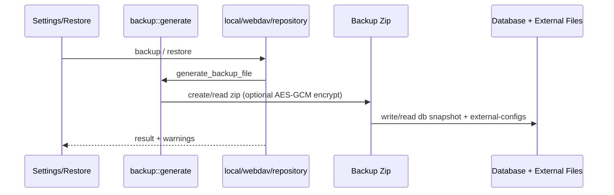

# Backup 后端模块说明

## 一句话职责

- `backup/` 负责本地备份恢复、WebDAV 备份恢复、GitHub/Gitee 仓库备份恢复、可选备份加密和自动备份调度。

## Source of Truth

- 三个存储渠道（local / webdav / repository）共享同一生成与恢复管线：
  - 生成层 `generate.rs::generate_backup_file`：读设置 → `create_backup_zip`（范围、过滤、SQLite、外部文件的唯一事实源仍是 `utils.rs::write_backup_zip_contents`）→ 可选加密 → 共享文件名。存储层只接收完成字节，禁止查询 provider/MCP/Skills 等业务表。
  - 恢复层 `restore.rs::restore_from_archive<R: Read + Seek>`：本地文件、WebDAV 下载、仓库下载都先经 `prepare_backup_bytes`（按文件头识别加密并解密），再走同一管线。不要在某个渠道复制第三份恢复实现。
- 加密封装 `encryption.rs`：`AI-TOOLBOX-BACKUP-ENC-1\0` magic + 随机 32 字节 salt + 随机 12 字节 nonce + AES-256-GCM 密文；PBKDF2-HMAC-SHA256 600000 次；magic/header 参与认证。识别加密**只看文件头**，不看 `.zip.enc` 后缀。
- 备份加密密码保存在本机系统凭据库（`credentials.rs`，keyring：Windows Credential Manager / macOS Keychain / Linux Secret Service），AppSettings 只存 `backup_encryption.enabled` 开关和固定 `credential_ref`。密码不进入 AppSettings、备份包、日志或前端。加密开启但凭据库读不到密码时整个备份失败，**绝不降级为未加密上传**。
- 文件名契约 `filename.rs`：新格式 `ai-toolbox-backup-<YYYYMMDD>-<HHMMSS>-<unique8>[_<host>].zip[.enc]`（unique8 保证同秒/多设备不冲突）；同时兼容 current（无 unique）与 legacy 前缀命名。仓库列表、本地保留数量清理、WebDAV 列表都必须用共享识别（含 `.zip.enc`），不能裸匹配 `.zip`。
- 仓库适配器 `repository.rs`：配置单位是 仓库/分支/相对目录；每次备份是独立文件。GitHub 新建用 Contents PUT、Gitee 用 Contents POST（均不带 sha，同名旧文件天然不可覆盖）；GitHub 按 100 MB 预检上传（Gitee 不套用该上限，透传服务端错误）；删除绑定列表返回的 SHA（GitHub DELETE body / Gitee DELETE query）；下载先取 metadata 校验 SHA 再读内容。所有请求走全局 `http_client`（rustls）；错误与日志不泄露 Token（Gitee 的 access_token 在 query 中，不能打印 URL）。
- 仓库目录枚举：Contents 单次请求，**不做分页循环**（Gitee Contents 官方 schema 根本没有 page/per_page，参数被忽略，循环会无限重取同一批）。GitHub 目录 ≥1000 条、Gitee 目录 ≥100 条时改走 Git Trees recursive（branch → commit sha → `git/trees/{sha}?recursive=1`，两平台同构；Tree 条目只有 `path` 没有 `name`，文件名取 path 末段）。Trees 响应的 `truncated` 是唯一完整性信号：`truncated=true` 的列表可以展示但**绝不能驱动保留数量清理**（`list_backups_detailed` 返回 complete 标志，cleanup 拒绝删除）。
- 私有仓库限制的执行点在 `upload_file`（每次真实写入前先做一次只读 repo GET 校验 `private=true`），不是只在测试连接命令里；跳过测试连接或测试后仓库转公开都不能绕过。
- GitHub 100 MB 的预检错误与通用大小错误分开：服务端 HTTP 413、下载读取的保护上限使用不带平台数值的 `fileTooLarge` 提示，不能向 Gitee 用户声称触发了 GitHub 的文件限制。
- 仓库连接与 Token 存 `settings:backup_repository` 独立记录（Token 不回显，DTO 只有 `has_token`）；旧 `settings:repository_sync` 在新记录缺失时只迁移连接字段与 Token。检查新记录、读取旧记录和持久化迁移必须在同一 SQLite 事务内；读取入口和保存入口共用该流程，避免尚未加载设置就保存时丢失旧 Token，也避免并发迁移覆盖新连接。保存结果直接使用事务返回的连接，不在提交后重新读取另一份状态。
- 备份设置保存的凭据读取、新密码写入、SQLite 提交与失败回滚在同一个 blocking 操作内执行，并与后台备份的密码读取共用锁，避免读到尚未提交的新密码。`PasswordStore` 是隔离测试边界，测试不得访问真实系统凭据库；回滚失败必须返回单个 `{type, message, suggestion}` JSON 错误，保留保存失败与回滚失败原因，不拼接两个无法被前端解析的 JSON。
- Token/凭据选择规则全仓库唯一：`resolve_repository_token`（草稿 token 非空则替换；为空时仅同平台复用旧 token，跨平台必须先报 `tokenRequired` 再发网络请求）。保存路径与测试连接路径都必须走它，不要另写第二套复用逻辑。
- 只有当前选择仓库渠道时才验证、更新仓库草稿；本地/WebDAV 保存必须保留数据库中的仓库连接和 Token，即使隐藏草稿是半填、跨平台或过期值。仓库渠道本身保存空白草稿（owner+repository 均空）才清空连接和 Token；`branch=main` 默认值不表示已经配置连接。已配置仓库的空 directory 表示仓库根目录，不能在表单读回时替换成默认目录。
- 备份加密状态读取 `encryption_status` 对凭据库失败是**尽力而为**：返回 `password_known=false`（前端显示未知态），绝不把"状态读不到"变成"设置保存失败"（settings 已落库）。生成加密备份时凭据库不可用仍然整体失败（不降级明文）；恢复路径凭据库读失败映射为 `passwordRequired`，让知道密码的用户走手动一次性输入。
- 备份包里的 `sqlite/ai-toolbox.db` 是 SQLite 主数据库快照；`db/` 只保留兼容旧 SurrealDB 备份/恢复流程的占位或 legacy 内容；`external-configs/` 是外部运行时配置和 prompt/auth 等文件快照。默认情况下数据库快照与外部文件两者都写入。
- `backup_cli_config_files_enabled` **只控制** Codex / Claude / Grok / Gemini / Kimi CLI 这些 DB-backed 工具的运行时文件是否进包、是否恢复（默认开启；缺字段按 `true`）。关闭后这些 optional 工具的 `external-configs/<tool>/`（含 `root-dir.txt`）不打包也不恢复，渠道/prompt 靠 SQLite + re-apply 重建。
- **OpenCode / OpenClaw / Pi** 的 provider/model/main config 以运行时文件为主数据，**始终**进入备份/恢复（仍受 `backup_file_filter_rules` 约束）。开关关闭不会跳过它们。
- 图片工作台资产文件默认进入备份包；是否写入 `image-studio/assets/` 由应用设置 `backup_image_assets_enabled` 控制，默认开启。
- 每个备份 zip 根目录写入 `backup_meta.json`（`version` + `cli_config_files_included`）。`cli_config_files_included` 表示 **optional（DB 型）** CLI 运行时是否完整进包，不等于“所有 external-configs 都无”。`need_reapply` 仅在「本次恢复跳过 optional CLI 运行时」或「meta 明确 `cli_config_files_included=false`」时为 true；**旧包无 meta 不因缺 external-configs 推断 re-apply**，避免残缺旧包误改本机配置。
- app data 下的动态资源缓存文件也是备份恢复对象，包括 `preset_models.json`、`models.dev.json`、`model_pricing.json` 和 `gateway_provider_profiles.json`；它们是远端数据缓存，不是仓库内 bundled resource 文件。
- 自定义备份项是 Backup 自己的 source of truth，不复用 SSH/WSL file mappings；保存路径时优先使用 `~/...` 或 `%APPDATA%/...` 这类可迁移格式。
- 文件过滤规则 `backup_file_filter_rules` 控制哪些工具路径应从备份包中排除，以及恢复时跳过这些路径。该能力属于用户扩展配置，新用户默认不注入任何规则。持久化字段只使用 `file_path`；UI options 必须来自后端当前实际会写入 `external-configs/<tool>/` 的文件列表，并尽量使用 `~/...` 这类跨平台可迁移路径。全局 CLI 开关关闭时：optional 五工具整类不进包（过滤规则无对象）；always 三工具仍进包，过滤规则继续生效。
- restore 后真正继续参与运行的，不只是解压出来的文件路径；任何还会被后续同步/托盘/WSL/SSH 依赖的元数据也必须保持一致。
- 自动备份是否运行由应用设置驱动，调度器只消费设置，不自己持久化业务状态。
- 恢复时「是否跳过 optional CLI external-configs」必须读 **恢复开始前** 的本机 settings，绝不能在 SQLite 覆盖后再读；always 三工具不因该开关跳过。
- 恢复确认可选 `skip_cli_custom_roots`：在 SQLite restore 成功后清空各 CLI common 的 `root_dir` / `config_path`（id=`common`），避免跨机旧路径；默认不勾选。
- 当 need_reapply 时写 `{app_data}/.reapply_applied_required`；启动 delayed task **串行**：refresh runtime location → re-apply 已应用 provider/prompt/config → skills → MCP → Windows 下单次受限范围 WSL sync。Flag 先删后跑；普通启动 WSL sync 检测到 restore flag 时必须让位。`.resync_required` 不是纯布尔：恢复阶段直接写回过的 `external-configs/<tool>/` 模块要写入 flag payload，最终 WSL sync 的 changed module 集合必须合并「直接恢复的模块」和「re-apply 改写的模块」。

## 核心设计决策（Why）

- 备份不是只备份数据库，还要把各工具外部配置文件、prompt、auth、skills 等一起打包，否则恢复后会出现“库里有记录、运行时文件缺失”的分叉。
- Skills 文件备份/恢复必须以当前 `skill_settings:skills.central_repo_path` 解析出的中央仓库目录为准，而不是固定 `{app_data_dir}/skills`。恢复 SQLite 快照后再解析该路径；若目标目录不存在，恢复流程负责创建。
- 三渠道共用生成/恢复管线但保留各自薄包装命令：网络错误与本地文件错误分别处理，同时保证任何渠道的备份在任何渠道语义一致（同一 zip 结构、同一加密格式、同一恢复 flags/warnings）。加密只改变文件的存储表示，不改变备份内容语义。
- 备份加密密码放系统凭据库而不是 SQLite：重启后的自动备份能读到密码，同时密码不进入备份包本身；跨设备恢复不迁移凭据，恢复加密备份时输入的密码默认只用于本次解密。
- 自动备份作为后台调度器常驻运行，周期性读取设置并决定是否执行，而不是把调度状态散落到 UI 层。
- 自定义备份项用 `custom-backup/manifest.json` 描述恢复目标，payload 使用稳定相对路径存放，避免把绝对路径直接作为 zip entry，也避免不同文件名互相覆盖。
- 本地备份先写 `.part` 临时文件再 rename，失败不会留下看似完整的备份。

## 关键流程

## 易错点与历史坑（Gotchas）

- 加密备份恢复/生成必须经过共享入口（`prepare_backup_bytes` / `generate.rs`）。任何渠道出现“缺密码、错密码、截断、篡改”都必须在**任何恢复写入之前**报错；`CryptoError::AuthFailed` 映射为 `passwordWrong`，`PasswordRequired` 映射为 `passwordRequired`，前端据此在同一次恢复选择中弹出密码框重试，取消与错误都不能修改数据库/外部配置。
- 恢复的密码优先级：显式传入的一次性密码 > 本机凭据库；**凭据库读取失败也按 `passwordRequired` 处理**（用户可能知道密码，不能剥夺手动输入机会），但生成加密备份时凭据库不可用仍整体失败，绝不降级明文。改密码只影响今后备份，旧备份仍用创建时密码；关闭加密不重写旧备份，也不清理已存密码。
- 文件名解析的所有定长切片必须走 `str::get`（非字符边界返回 None），不能 `&body[..15]` / `split_at` 直切——多字节主机标签（如中文 legacy 前缀）会直接 panic，且调度器不会捕获该 panic。
- 自动备份 repository 分支：未配置（空白连接）时**静默跳过**（与 webdav/local 一致），不要发 `auto-backup-failed`；上传与保留数量清理必须复用**同一个 `RepositoryClient` 快照**（`perform_repository_backup` 返回 client），不能在清理入口重新读设置——否则上传期间切换连接会让 A 仓库的成功触发 B 仓库的删除。
- 仓库渠道的回归测试用 `repository.rs::mock_api_tests` 的 TcpListener mock（`start_mock` 按序应答并记录 `METHOD path`，query 剥离防 Token 入日志；`RepositoryClient::for_test` 跳过凭据校验指向本地监听）。私仓拦截、Trees 解析、truncated 清理跳过都有现成用例，改这块行为时先跑它们。
- `save_backup_settings` 的事务边界：凭据库写入在最前（失败则整体不动）；SQLite 内 patch settings 字段 + 写 `backup_repository` 记录同事务；DB 失败时把旧密码写回凭据库。并发保存其它设置不受影响（只 patch 备份字段），但不要把这个入口改回全量 `save_settings`。
- 备份/恢复的 JSON 错误载荷统一 `{type, message, suggestion}`（`credentials::backup_error`），`suggestion` 是 i18n key；前端解析 `type` 判断密码重试。错误 `message`/`detail` 不得包含密码或 Token。
- 数据目录覆盖从固定默认位置的 `app_paths.json` 启动引导；备份包不包含/恢复该文件。DB、图片资产、默认 Skills 路径及恢复 flags 都使用本次运行已冻结的数据根目录，保存下次启动目录后仍写当前目录。本地/WebDAV/仓库恢复标记写失败必须上报，不能成功返回却不触发后续同步。独立自定义 Skills 仓库仍由 `skill_settings` 决定，不因应用目录变化被重置。

- 不要把备份理解成“只有数据库”。`external-configs/` 下的 OpenCode/Claude/Codex/OpenClaw 配置、prompt、auth 等同样关键。
- 不要把 SSH/WSL 映射当作自定义备份项来源。SSH/WSL 是同步规则；自定义备份项是备份恢复规则，两者状态语义不同。
- 关闭 `backup_image_assets_enabled` 只跳过图片资产文件，不会跳过数据库里的 `image_job` / `image_asset` 元数据；恢复后历史记录可能存在但图片文件不可读，这是用户显式选择的体积取舍。
- 关闭 `backup_cli_config_files_enabled` 只跳过 **optional** 五工具的 `external-configs/<tool>/` 磁盘文件，不会跳过 DB 中已有记录；UI 仍可能显示「已应用」。Codex、Claude、Grok、Gemini、Kimi CLI 的 applied provider/prompt 会重建。OpenCode/OpenClaw/Pi 文件仍从 zip 恢复；re-apply 里 OpenCode 仍会补 applied prompt 与已存储的 Oh My 配置，Pi 补 applied prompt，OpenClaw 不 re-apply；provider/model/main config **不从数据库猜写**。
- `skip_cli_custom_roots=true` 时，SQLite restore 后要清空 common 中的 `root_dir/config_path`，且所有工具都不得读取备份里的 `root-dir.txt`。开关关闭但未勾选该选项时：always 三工具仍可读各自 `root-dir.txt`；optional 五工具不读。
- re-apply 中 provider、prompt 和 Oh My config 是独立步骤：单步失败只记录 warning 并继续；Gateway takeover 只跳过被接管工具的 provider 投影，不能连 prompt 一起跳过。
- 恢复启动编排中 `.reapply_applied_required` 优先并执行已含 OMO/OMOS 的全量 re-apply；只有 `.resync_required` 时仅串行重建 OMO/OMOS，随后继续 Skills、MCP 和单次 WSL sync，不能借普通恢复重写其它 CLI。
- 恢复专用 apply/MCP 入口不得发中间 `wsl-sync-request-*`、`mcp-changed` 等自动同步事件。最终 WSL 同步只传播本轮实际改写的 CLI 模块，同时同步 MCP/Skills 一次，不能顺手覆盖受保护的 OpenClaw/OpenCode/Pi 本机运行时文件。
- 普通 `timeout(work())` 无法可靠抢占卡在同步文件 I/O 的 future。re-apply 要在独立 task 中运行，超时后 abort 并继续下一个 CLI；写入前再用 `spawn_blocking` 做短时无写入路径探测，降低不可达 UNC 路径拖死恢复链路的概率。
- 新增外部配置文件进入备份时，要同时检查本地备份、WebDAV 备份、仓库版本和 restore 路径，不要只改一个入口。所有从 zip entry 派生的 restore 输出路径都必须经过 `resolve_external_config_restore_output_path`（或等价共享安全 helper），不能直接 `restore_dir.join(entry_path)`；共享恢复实现已经统一这一点。
- 新增 app data 缓存文件进入备份时，也要同时检查生成层与 restore 路径；这些文件通常位于 zip 根目录，和 `preset_models.json` 的处理方式保持一致。
- SQLite-only 用户迁移完成后通常没有 `{app_data}/database` legacy 目录；自动备份不能因为这个目录缺失而失败，必须继续写入 `sqlite/ai-toolbox.db` 和 manifest。
- Codex 全局 prompt 备份要同时保留两个已存在的已知文件：`AGENTS.md` 与 `AGENTS.override.md`。即使 override 当前生效，基础 `AGENTS.md` 仍是未来清空/删除 override 后的回退数据，不能只备份 active 文件。
- Grok 外部状态备份覆盖当前 runtime root 下的 `auth.json`、`config.toml`、`AGENTS.md` 和 `plugins/`，不默认备份 `sessions/`；恢复时必须尊重动态 root 与统一文件过滤规则。
- Grok / Kimi `plugins/` 备份跳过 `.git`、`node_modules`、cache、build/dist/target 等可重建内容；目录中的 symlink 不跟随，恢复目标的现有相对路径组件若是 symlink 必须拒绝，避免写出 runtime root。
- Kimi 外部状态备份覆盖当前 runtime root 下的 `config.toml`、`AGENTS.md`、`credentials/` 和 `plugins/`；`clear_restored_cli_custom_roots` 必须同时清 `KimiCommonConfig` 的 `root_dir`，否则跨机恢复后旧 root 仍生效。备份过滤选项枚举 Kimi `credentials/` 时的目录遍历必须在 `spawn_blocking` 中进行——root_dir 可能是不可达 WSL UNC，同步 WalkDir 会阻塞 tokio worker。注意该规则只约束过滤选项枚举路径；备份 zip 写入路径（`write_external_configs_to_backup_zip`）对 credentials/plugins 的 WalkDir 仍是同步执行，沿袭 Grok plugins 既有模式，属全部 external-configs 写入共享的既有架构——如需根治应在 zip 写入整体层做 spawn_blocking，而不是只改 Kimi。
- Grok 的 `auth.json` 和可能包含模型 API key/header 的 `config.toml` 都按敏感文件处理；Unix 恢复后权限统一收紧为 `0600`。
- restore 处理跨平台路径时，不要只修提取路径；任何被后续同步或状态计算继续消费的元数据都要同步规范化。
- 非 Windows 目标恢复 Claude `settings.json` 时，必须通过共享 `coding::config_cleanup` 平台规则移除 Windows-only env；SQLite 快照里的 Claude common config、provider `settings_config` 和 `extra_settings_config` 也要同步清理，避免恢复后下一次 apply/provider 切换又把这些字段写回运行时文件。这个清理不应影响 Windows 上的恢复。
- 自定义目录恢复只覆盖备份包中存在的文件，不清空目标目录里额外文件；这是备份恢复，不是镜像同步。
- `zip::ZipWriter` 不允许重复 entry。新增外部配置目录或文件进入备份时，不要直接多次 `add_directory("external-configs/<tool>/")`；应复用共享写入链路并让目录 entry 幂等写入，否则自定义根目录与配置文件同时存在时会报 `Duplicate filename`。
- 文件过滤规则是统一的：备份时排除 = 恢复时跳过。不要为备份和恢复维护两套独立的过滤逻辑。
- 过滤规则按「工具 + 路径」精确匹配，不是全局文件名过滤。`~/.local/share/opencode/auth.json` 和 `~/.codex/auth.json` 是两条独立规则。
- 规则存在即生效，删除即失效；不要重新引入 `enabled` 或“预置”语义。
- UI 允许用户添加文件过滤规则时，后端不能只在少数固定文件处硬编码判断；所有 `external-configs/<tool>/<relative_path>` 的写入和恢复都必须经过同一个过滤 helper，确保用户规则真实生效。
- 恢复操作应使用操作开始前的当前过滤规则，避免旧备份里的 settings 覆盖当前用户用于保护本机路径的排除规则。
- 过滤只影响文件是否进入备份包/是否从备份包恢复，不影响数据库状态。跳过 auth.json 不会清理数据库中的 provider 配置。
- OpenList/AList 的 WebDAV 下载若走「302 重定向」策略，GET 会被 302 指向上游网盘 CDN 签名地址（115 防盗链），通用客户端拿不到 Cookie/IP 绑定会得到 403。这不是账号认证错误：列目录（PROPFIND）和上传（PUT）都能过，唯独下载/恢复 GET 报 403，且内网（出口 IP 匹配）能下、公网/Bind 不匹配会 403。修复在服务端（改「本机代理/本地代理」下载策略、升级服务端、或改用原生驱动），本 app 无法根治。对应地，WebDAV 下载（GET）的错误映射不能用通用 403→authFailed：要比较 `response.url()` host 与配置 host，若 403 且被重定向到外部 host，则应返回 `settings.webdav.errors.downloadRedirect` 型诊断，避免误导「改用户名密码」。
- SQLite 快照恢复是**原地覆盖 live DB 再跑迁移**（`conn.restore` 原地覆盖 → 同连接 `run_all` 迁移）。这个顺序有一个致命的数据安全要求：恢复前**必须**先对当前 live DB 取一份安全备份（temp 文件），迁移或 restore 任一步失败时**必须**用该安全备份回滚 live DB，否则 app 会卡在「被旧 schema 覆盖、迁移又失败、原数据已不可恢复」的降级态且无法回到恢复前状态。回滚本身若也失败，要把「恢复失败 + 回滚失败」一起上报。同样，解压出的快照临时 DB 文件清理不能放在恢复 `?` 之后——恢复失败会提前返回跳过清理，泄漏完整大小的大文件；应先取 `result` 再无条件 `remove_file`，最后 `result?`。
- `db::backup::backup_to_path` 是「先 checkpoint 再 backup」的安全拷贝入口，新增任何「在恢复前保留一份可回滚的旧态」场景都复用它；不要在 backup utils 里另写 `conn.backup` 直调。
- 旧 SurrealDB-only 备份（zip 有 `db/` 但无 `sqlite/ai-toolbox.db`）恢复到已迁移到 SQLite 的应用是**静默无效**的（启动时旧目录只会被归档删除、不会导入），restore 必须显式报错拦截；未迁移机器仍允许解压走一次性导入。`cleanup_incomplete_sqlite_database` 在删除现有 SQLite 前必须先经 `backup_to_path` 存一份 `{app_data}/ai-toolbox.pre-import-backup.db`，备份失败则拒绝删除（否则导入失败时原库已无回退点）。
- 备份/恢复元数据要点：hermes 备份 zip entry 必须用真实 prompt 文件名（`SOUL.md`，走 `hermes::constants::HERMES_PROMPT_FILE`），不要写成仓库内 agent 文档的 `AGENTS.md`；hermes/dsh 都有 WSL 文件映射，`wsl_module_for_external_config_tool` / 恢复 resync payload 必须包含它们；Claude Desktop 是 Windows/macOS 桌面应用，没有 WSL 文件映射，不应加入 resync payload。`clear_restored_cli_custom_roots` 除 `root_dir/config_path` 外还要清 hermes/dsh 的 `config_dir`，否则恢复后的默认目录文件不会被读到；过滤规则路径归一化 `tool_prefixes` 必须覆盖 hermes（`~/.hermes/` 与 `%LOCALAPPDATA%/hermes`）、dsh（`~/.dsh/`）、claude_desktop（`%LOCALAPPDATA%/Claude` 与 `%LOCALAPPDATA%/Claude-3p`）。新工具接入备份按本文件「新增 CLI / coding 工具接入备份时（必做清单）」逐项走。
- 自动备份的 `last_auto_backup_time` 同时用于成功记录和失败节流（失败也写入以防每 10 分钟重试）；新备份真正成功后才执行保留数量清理，清理失败只是 warning，不能把已上传的备份说成不存在或回滚成功状态。`max_keep=0` 沿用不清理。

## 跨模块依赖

- 依赖 `runtime_location` / backup utils 解析各工具当前实际配置、prompt、auth、skills 路径。
- 被 `settings/` 前端与 `lib.rs` 启动阶段依赖：恢复后可能触发 re-apply + skills/MCP 重同步，自动备份调度器在启动时常驻运行。
- 与 `coding::reapply_applied_runtime` 耦合：跳过 CLI 配置恢复后由该 helper 串行 re-apply 各 CLI 已应用渠道/prompt。
- 与 `skills/`、`wsl/`、`ssh/` 间接耦合：恢复出来的文件和元数据后续会继续被这些模块消费。
- 加密依赖 `ring` + `zeroize`（AES-256-GCM / PBKDF2 / Zeroizing）。`keyring` v4 当前保留默认 `v1` 兼容入口并启用 `apple-native-keyring-store`，默认按平台选择持久化系统凭据后端；不能把示例或 mock 凭据库接入产品。具体 feature 名称以 `Cargo.toml` 和锁定版本为准。

## 典型变更场景（按需）

- 新增某类外部文件进备份时：
  同时检查 backup zip、restore 输出路径、WebDAV 版本和 restore warning。
- 改自动备份策略时：
  同时检查 local/webdav 两条执行路径、失败节流和保留数量清理。
- **新增 CLI / coding 工具接入备份时（必做清单）**：
  1. **先定数据所有权**：provider/model/main config 以 **SQLite 为真源** 且可 re-apply → 归 **optional（DB 型）**，受 `backup_cli_config_files_enabled` 控制；以 **运行时文件为真源**、不能从 DB 猜写渠道 → 归 **always**，开关关闭也必须进包/恢复。
  2. **实现同步改全链路**（不要只改写入）：
     - `utils.rs`：`ALWAYS_BACKUP_CLI_TOOLS` / `OPTIONAL_BACKUP_CLI_TOOLS`（或等价分类）；`write_external_configs_to_backup_zip` 写入段；`list_backup_file_filter_path_options` 过滤可选项；
     - `local.rs` + `webdav.rs`：restore 分支、`should_skip_external_config_on_restore` / root-dir 策略、`record_restored_external_config_wsl_module`；
     - 若有 applied 状态：`reapply_applied_runtime` 是否重建 provider/prompt，以及开关 OFF 时是否依赖 re-apply。
  3. **文案与文档**：更新 `web/i18n` 中 `settings.backupSettings.cliConfigFiles` / `cliConfigFilesDesc` / `restoreWillReapply` / `fileFilterRules.disabledByCliConfigFiles` 里点名的工具列表（中英文一致）；同步本文件 Source of Truth 中的 always/optional 名单。
  4. **验证**：开关 ON/OFF 各打一包，确认新工具是否按分类进包；OFF 时 always 仍恢复、optional 不覆盖本机；过滤规则对新 tool 生效。

## 最小验证

- 修复设置、凭据或迁移时跑 `cargo test --lib settings::backup --jobs 2`，包含真实保存函数的 SQLite 往返、非当前渠道草稿隔离、密码写入失败/回滚失败、旧记录先保存后读取，以及解密错误映射。全量交付仍按根目录要求执行完整 `cargo test --jobs 2`。
- 至少验证：备份包里包含 `sqlite/ai-toolbox.db`、`db_manifest.json` 与相关 `external-configs/` 内容；SQLite-only 场景下不能要求 legacy `db/` 目录有真实数据库文件。
- 至少验证：restore 后关键外部配置文件落到正确位置。
- 加密链路至少验证（`encryption.rs`/`filename.rs` 单测覆盖）：加解密往返、每次加密新 salt/nonce、错误密码/篡改/截断/空密码全部失败、magic 头识别；新旧三类文件名 + `.zip.enc` 后缀解析；恢复端到端验证错误密码时数据库零写入。
- 涉及仓库渠道时至少验证：配置校验（owner/repo/branch/目录逃逸拒绝）；真实私库上传/列表/按 SHA 下载/删除需要真机验证，mock 不能代替。
- 涉及自定义备份项时，至少验证：`custom-backup/manifest.json` 存在、payload 文件存在、restore 后按 `~/...` 或 `%APPDATA%/...` 写回目标路径。
- 若本轮只改了文档或静态逻辑，也要明确说明尚未做真实备份→恢复端到端验证。
